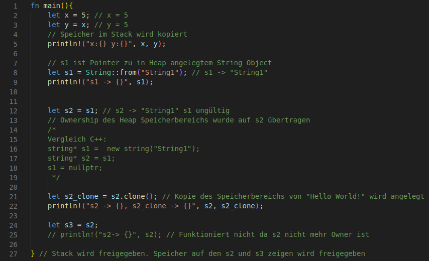
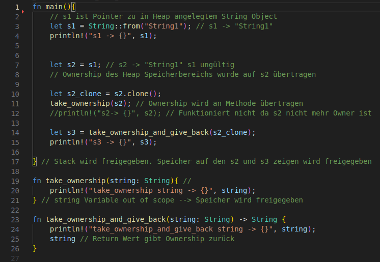
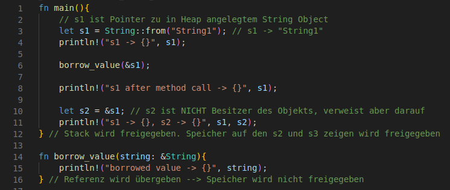
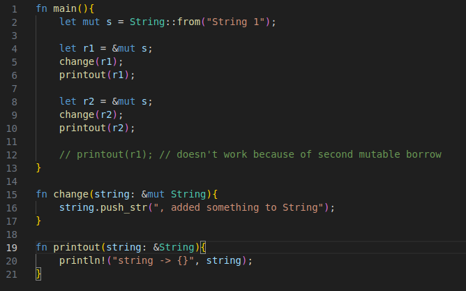
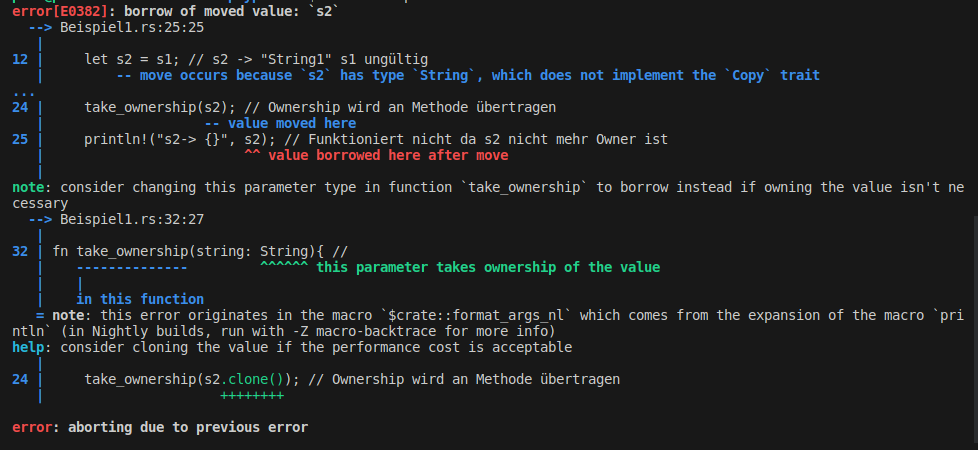
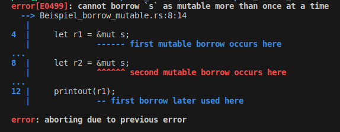

# OwnershipTypesRust
Seminararbeit zum Thema Ownership Types in Rust

# Ownership in Rust
Rust nutzt das Prinzip der Ownership von Objekten zur Speicherverwaltung. Insbesondere um die Verwaltung des auf dem Heap angelegten Speichers. Ähnlich wie Sprachen wie C und C++ besitzt Rust keinen Garbage Collector, dass bedeutet angelegter Speicher muss manuell freigegeben werden. Historisch zeigte sich jedoch das die selbständige Speicherverwaltung zu einigen Problemen führen kann. So muss angelegter Speicher genau einmal freigegeben werden. Um dies in Rust zu garantieren wird das Prinzip der Ownership verwendet. Ein Pointer der auf ein Objekt zeigt und somit seine Speicheraddresse kennt ist der Owner dieses Objekts, sobald dieser Pointer out-of-scope geht wird der verwiesene Speicherbereich automatisch freigegeben. Sollte nun eine zweite Variable angelegt werden, die das selbe Objekt referenziert, so ist dieser Pointer der neue Besitzer des Objekts. Dies hat zur Folge, dass die zuerst Angelegte Varible nicht länger auf das Objekt zugreifen kann um ein doppeltes freigeben des gleichen Speicherbereichs ausschließen zu können.

# Beispiele
## Move Semantik
In der folgenden Grafik ist zu erkennen das Pointer s1 ungültig wird, sobald Pointer s2 auf das selbe Objekt verweist.


Quelle: https://doc.rust-lang.org/book/ch04-01-what-is-ownership.html

### Simples Beispiel



Speicher im Heap besitzt immer einen sogenannten Besitzer, in der Regel ist dieser ein Pointer auf das entsprechende Objekt (vgl. Zeile 8). Sobald ein weiterer Pointer auf das Objekt zeigt ist dieser der neue Besitzer des Objekts und der ursprüngliche Pointer ist nicht mehr gültig (vgl. Zeile 12). Falls das Objekt kopiert werden soll so muss dies explizit angegeben werden (vgl. Zeile 21).

### Beispiel mit Methoden



Sollten solche Objekte an Methoden übergeben werden, so ist der neue Besitzer des Objekts ebenfalls die Methode (vgl. Zeile 11). Nur falls die Methode das Objekt beziehungsweise den Pointer auf das Objekt wieder zurückgibt, wird das Objekt nicht aus dem Speicher entfernt (vgl. Zeile 14).

## Borrow Semantik
### nicht veränderbare Referenz



Mithilfe der Borrow Semantik ist es auch in Rust möglich mehere Pointer auf das selbe Objekt verweisen zu lassen. Dies ist wie im obigen Code Beispiel zu sehen sowohl mit neuen Variblen als auch bei der Übergabe an Methoden möglich.


```
fn main(){
    let s1 = String::from("hello");
    let len = calculate_length(&s1);
} // s1 goes out of scope and the String object is deleted

fn calculate_length(s: &String) -> usize {
    s.len()
} // s goes out of scope but since it has no ownership the object is not deleted
```

Quelle: https://doc.rust-lang.org/book/ch04-02-references-and-borrowing.html

Wie in dem Beispiel zu sehen ist verweist bei die Referenz bei der Borrow-Semantik lediglich auf den eigentlichen Besitzer des Objekts

### veränderbare Referenz


Um veränderbare Referenzen zu erzeugen wird das Schlüsselwort "mut" verwendet, welches kurz für mutable (deutsch: veränderbar) ist. Pro Owner kann jedoch immer nur eine einzige solche veränderbare Referenz existieren.

# Error Meldungen
## Zugriff auf ungültigen Pointer


Der Rust Compiler erkennt selbständig, dass hier versucht wird auf einen Pointer zuzugreifen, der aufgrund der Move-Semantik nicht mehr gültig ist. Es wird angegeben, an welcher Stelle im Quellcode der Pointer ungültig wird, außerdem wird ein möglicher Lösungvorschlag zurückgegeben. 

## Doppelte Mutable Referenz


In Rust ist immer nur maximal eine veränderbare Referenz auf ein Objekt zugelassen, um sogenannte Race-Conditions zu vermeiden. Folglich führt ein Zugriff auf die Variable "r1" nachdem eine zweite mutable reference angelegt wurde zu einem Fehler.

# Aufgaben
- Warum werden primitive Typen kopiert ? --> feste größe im Speicher
- Lesezugriffe für nicht- owner --> Borrow Semantik (static reference & mutable reference)
- Allgemein Vergleich Move- Copy- Borrow-Semantik
- Beispiel in mehrere kleine (Anwendungs-)beispiele unterteilen

- Vergleich C++ 
    - Code zeigen
    - C++ Runtime <--> Rust Compile-Time

- Error Meldungen vorstellen
    - Typfehlermeldungen (wegen Speicherfehler)
    - Evtl noch Tool(s) suchen die bei der Lösung dieser Probleme helfen

- Siehe Readme Repo Prof. Sulzmann
 